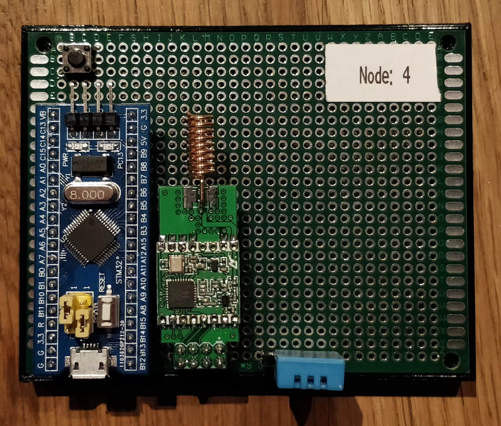
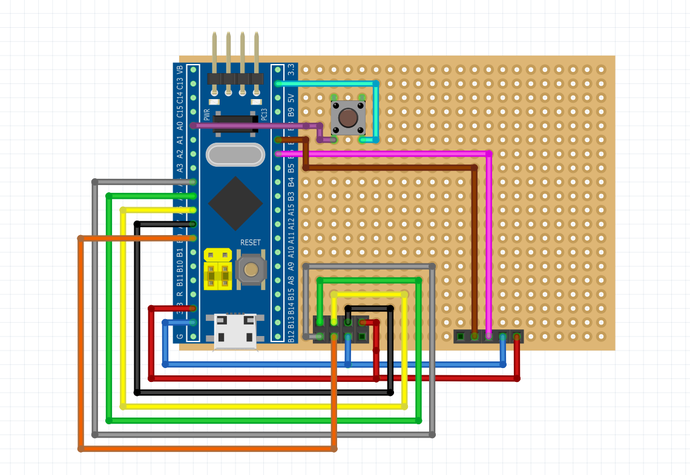

# Sensor-Board-Node

## Technisch

### Bestandteile
* Microcontroller
    * STM32
* Funkmodul
    * RFM69
* Sensor
    * Helligkeitssensor, Temperatursensor etc.
* Setup-Button
* Statusanzeige

    
### Funktionsweise
Mittels des Setup-Buttons kann das Sensor-Board in den Setup-Modus versetzt werden. 
Während des Setup-Modus läuft die Initialisierung des Boards ab, dabei wird unter anderem eine UUID(Unique unified ID) generiert bzw. vom Gateway bezogen. Des Weiteren werden die RDF-Daten an das Gateway übermittelt (bei anderen Boards ist dies auch mittels der MAC-Adresse möglich).
Als Antwort vom Gateway erhält das Sensor-Board eine gültige Bridge-Konfiguration, mit der anschließend eine Verbindung zur Bridge aufgebaut wird. Um die Daten permanent, auch nach Ausfall des Stroms zu behalten, werden diese in den EEPROM gespeichert. 
Anschließend erhält der Node vom Gateway eine UUID. 

### Beispiel Platinenlayout 

Hier sehen Sie ein mögliches Layoutdesign des Sensor-Boards.
Als Funkmodul wurde das RFM69 verwendet und als Sensor ein TSL2561 Helligkeitssensor.

