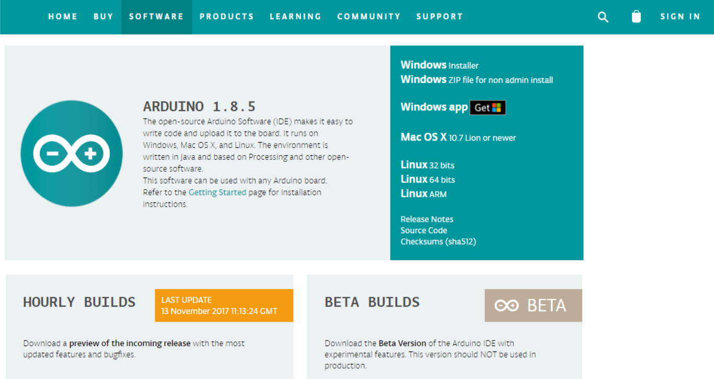
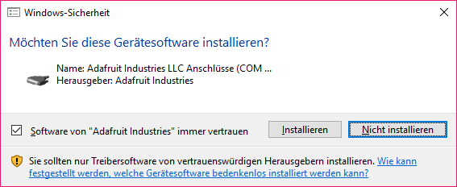
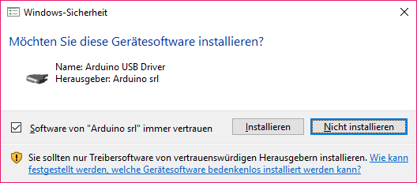
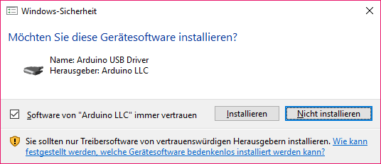
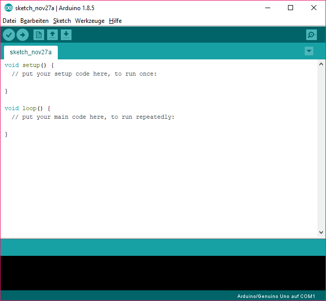

# Arduino installieren

Um Arduino nutzen zu können, muss die Software passend zum
Betriebssystem unter <https://www.arduino.cc/en/Main/Software>
heruntergeladen werden.

Durch das Ausführen der eben heruntergeladene
„arduino-1.8.5-windows.exe“ wird die Installation gestartet.

Nach erfolgreicher Installation, müssen noch folgende Installationen
durchgeführt werden

  

## Arduino starten

Nachdem Arduino gestartet wurde, erscheint folgendes Fenster:

