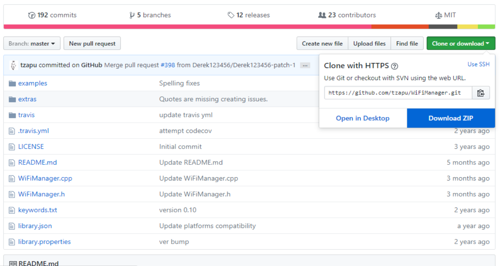
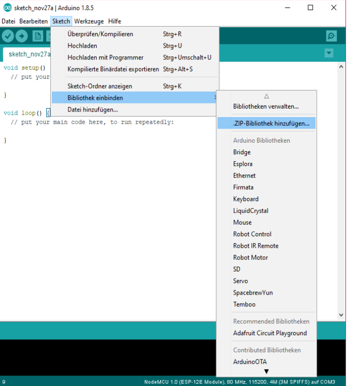
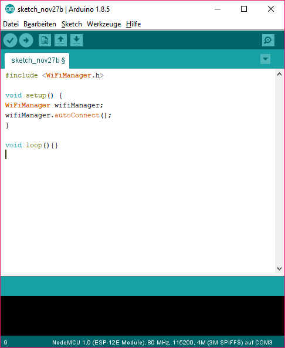
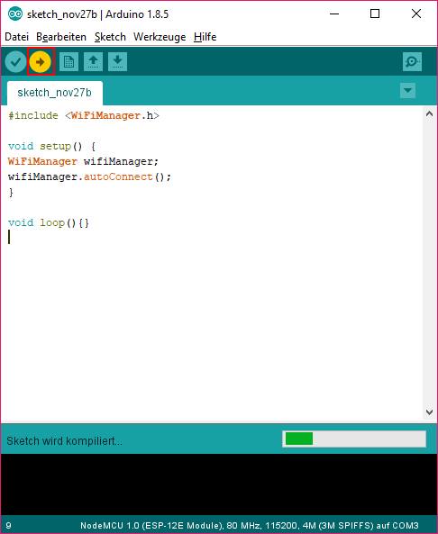
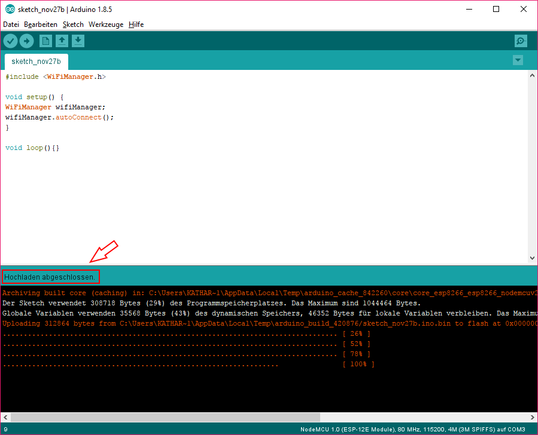

# Wifi-Manager starten und ausführen

## Wifi-Manager starten

Um den WifiManager verwenden zu können, muss dieser unter dem Link:
<https://github.com/tzapu/WiFiManager> heruntergeladen werden.

Es erscheint folgende Webseite:



Nach Herunterladen der Zip-Datei „WiFiManager-master.zip“ wird Arduino
gestartet.

Zum Einbinden der Bibliothek, muss die Zip-Datei unter *„Sketch
Bibliothek einbinden .ZIP-Bibliothek hinzufügen“* geöffnet werden.



## Erstes Testprogramm

Um den WiFi-Manager zu testen, wird ein neues Arduino-File geöffnet
(Menü Datei Neu oder über die Tastenkombination Strg+N)

Das erstes Testprogramm beinhaltet eine setup Funktion und eine loop


```
#include &lt;WiFiManager.h&gt;                                   
void setup() {                                                     
WiFiManager wifiManager;                                           
wifiManager.autoConnect();                                         
}                                                                
void loop(){}   
```

                 
 
 


Zum Hochladen des Programms muss der Button mit dem Pfeil geklickt
werden (rot markiert)



Nach erfolgreichem Hochladen erscheint im unteren Teil des Fensters die
Meldung „Hochladen abgeschlossen“ (im unteren Bild rot markiert)

