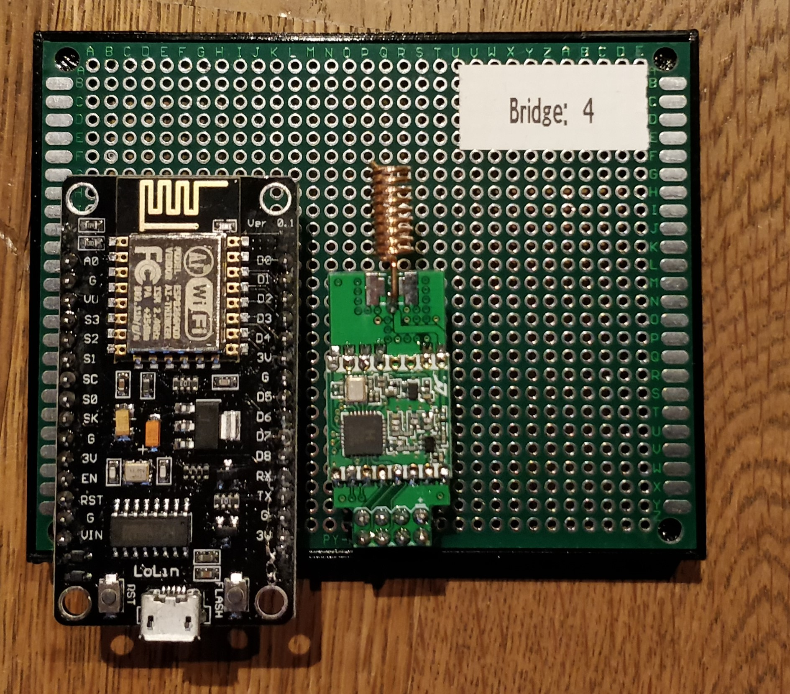
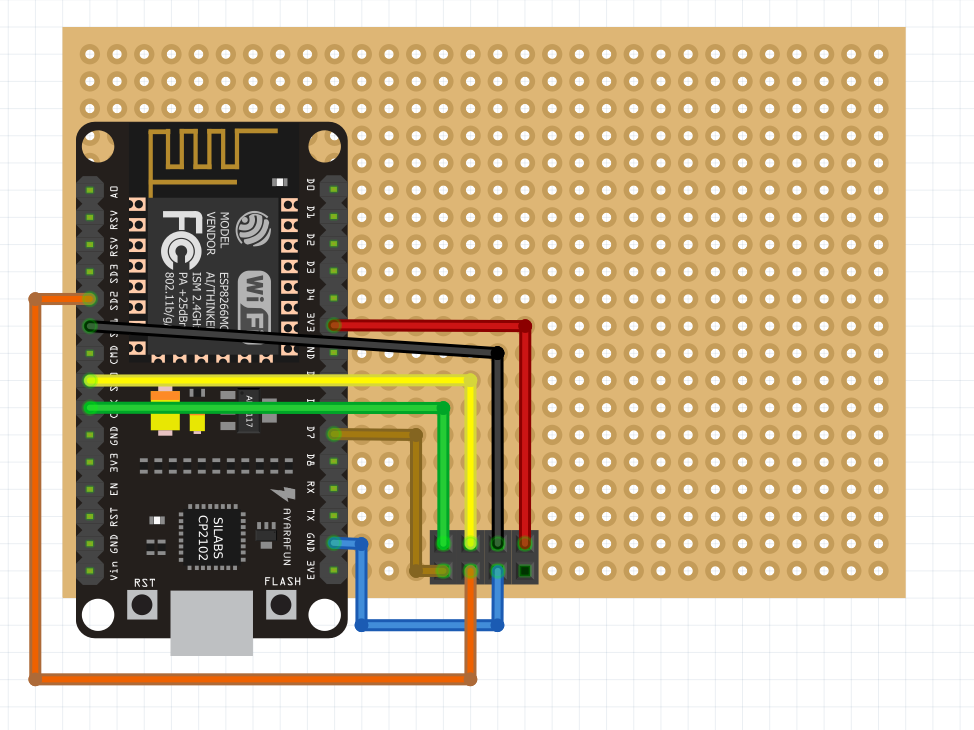

# Bridge

## Technological

### Components

* Network-compatible microcontroller
    * ESP8266
* Radio module (must be the same as on the sensor board node) 
    * RFM69 radio module
    

### Functionality

The bridge is receiving the sensor boards’ data from the radio module. For that matter the boards’ UUID and the sensors’ current measured data are transferred as a JSON-LD. Afterwards the bridge is building a connection to the gateway and is requesting the linked RDF-data of the associated UUID. According to these RDF-data the MQTT-URI is generated. After that the bridge is publishing the measured data via the particular topic to the MQTT-broker.     

### Example of the circuit boards’ layout

 

This picture is showing a possible layout of the bridge. The RFM69 was used as radio module and the ESP8266 as microcontroller.
