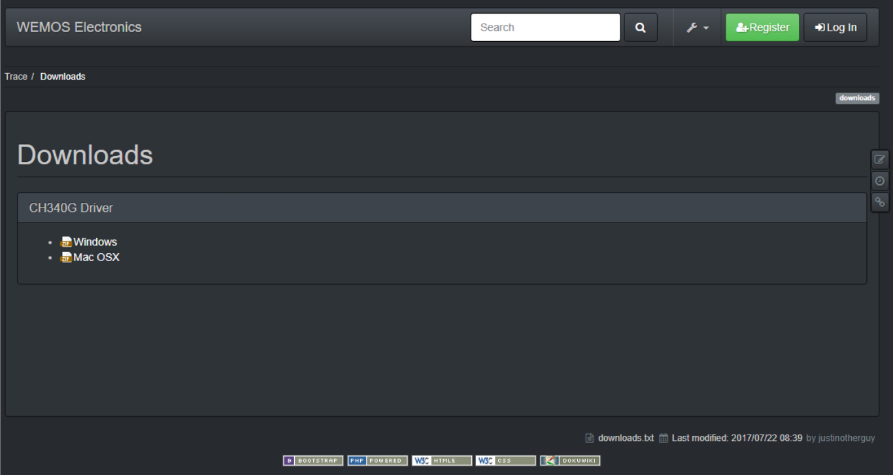
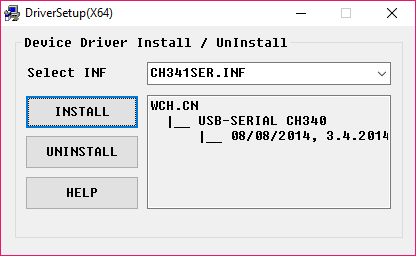
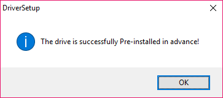
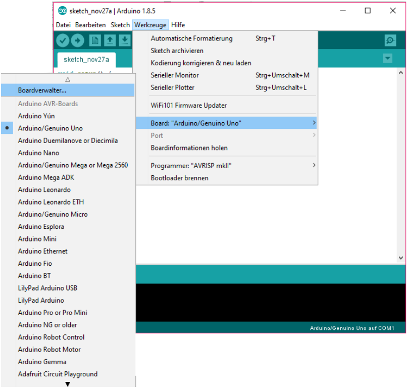
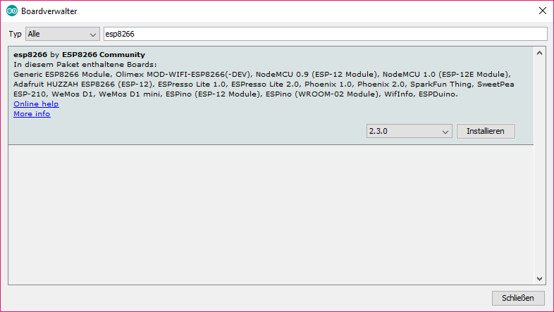
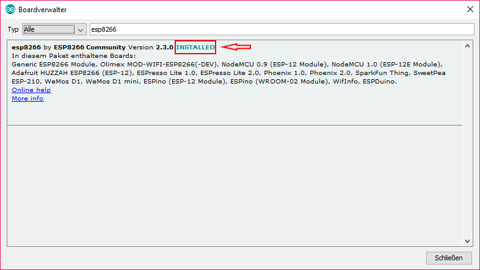
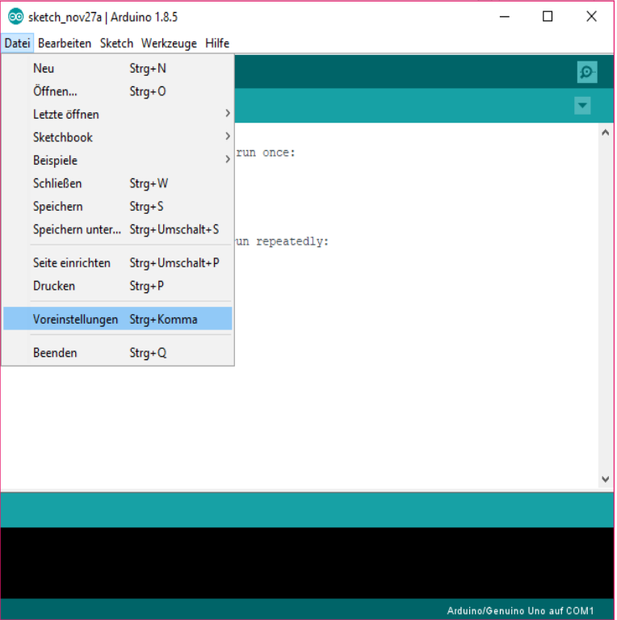
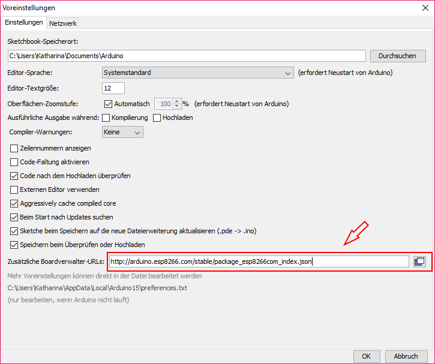
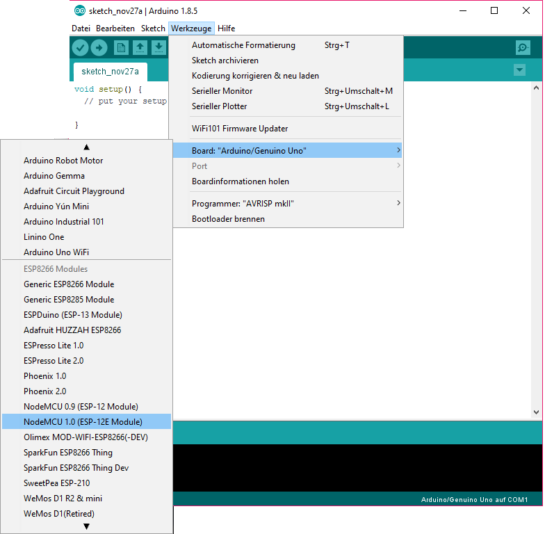
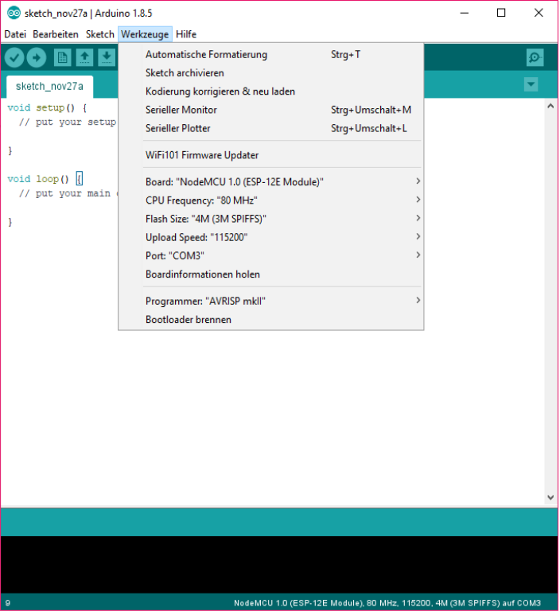

# Installation und Establishing of ESP

## Downloading and installing the driver of ESP

First you have to download the driver at the following link: <https://wiki.wemos.cc/downloads>

The following website is shown:

Here it is seperated between Windowns and Mac OSX. Download the suitable driver for your operating system.

### For Windows

After clicking "Windows", the download of „ch341ser\_win.zip“ is starting automatically. Run „CH341SER.EXE“ after unpacking. 

The following windows is shown:

To start the installation, you have to press the button "INSTALL". After the successful installation, the following window, which can be directly closed, is shown:

## Installing ESP8266-platform in Arduino:

To install the ESP8266-platform you have to open the boardmanager, which is located here:

### Tools Board“Arduino/Genuino Uno“ Boardmanager…

(check picture below)

Enter „ESP8266“ in the upper search field and click on it to install. You will get to see the button "Install" (check picture below)

When the installation is completed successfully, it is marked with a red "INSTALLED".

### Preferences in Arduino

To start working with the ESP, some preferences have to be set. Select *FILE* --> *Preferences* or use the shortcut *CTRL + COMMA* to get to the preferences.

The following window is shown:

Insert the URL *"http://arduino.esp8266.com/stable/package\_esp8266com\_index.json"* under *"Additional Board Manager URLs"* (marked red)

**Configuring the board in Arduino**

For the configuration of the board the *„NodeMCU 1.0(ESP-12E Module)“* is selected. To do that click on *Tools --> Board: " Arduino/Genuino Uno " NodeMCU 1.0* (check picture below)

Furthermore the following configurations have to be done:

-   Flash Size: "4M (3M SPIFFS)"
-   CPU Frequency: 80 MHz
-   Upload Speed: "115200"
-   Port: z.B. "COM5"

