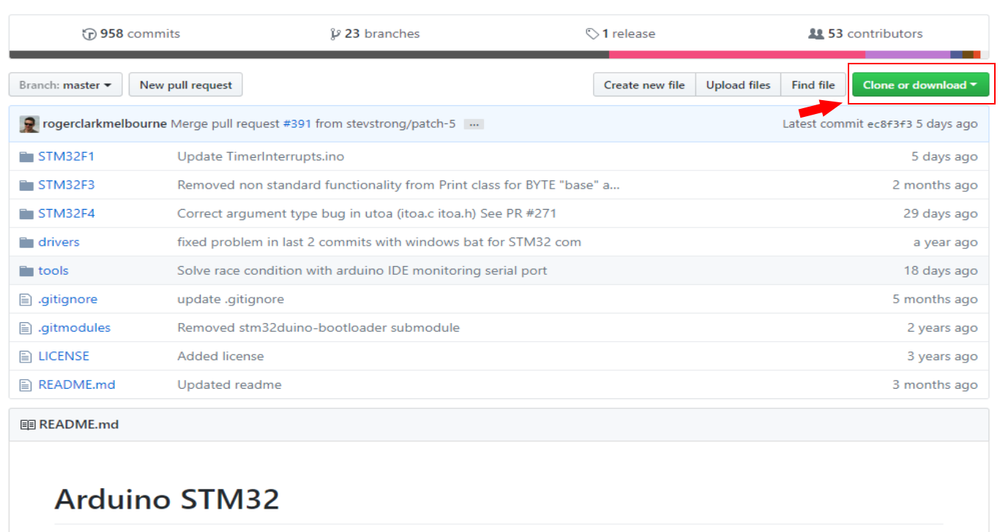
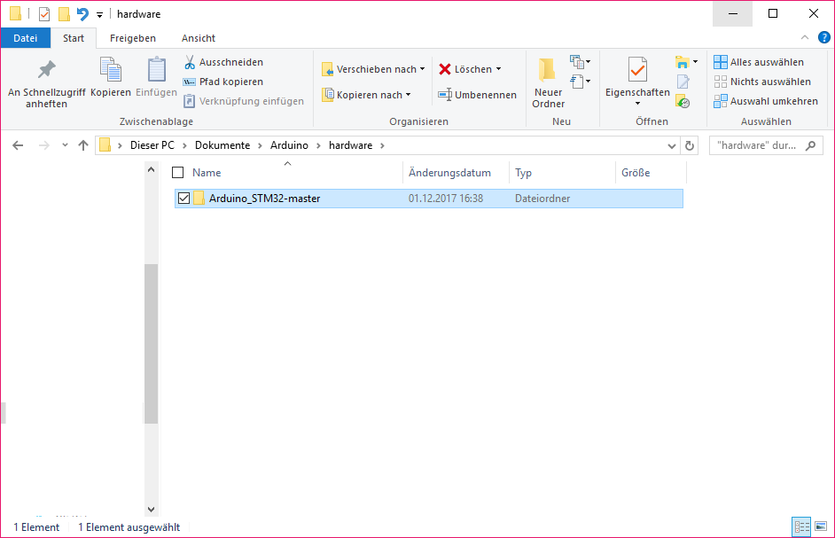
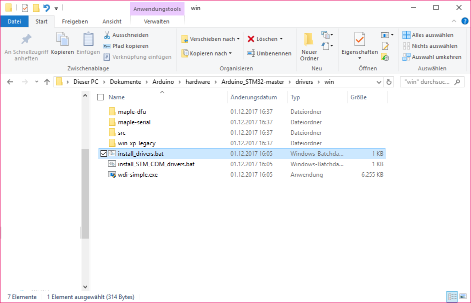
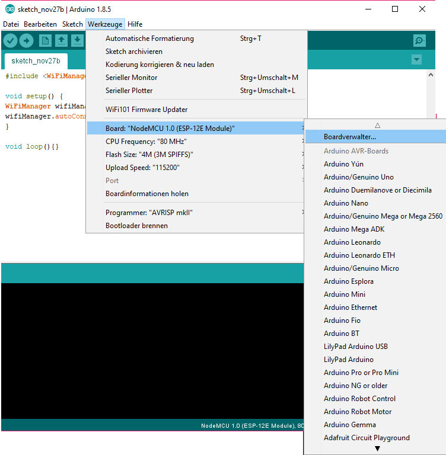
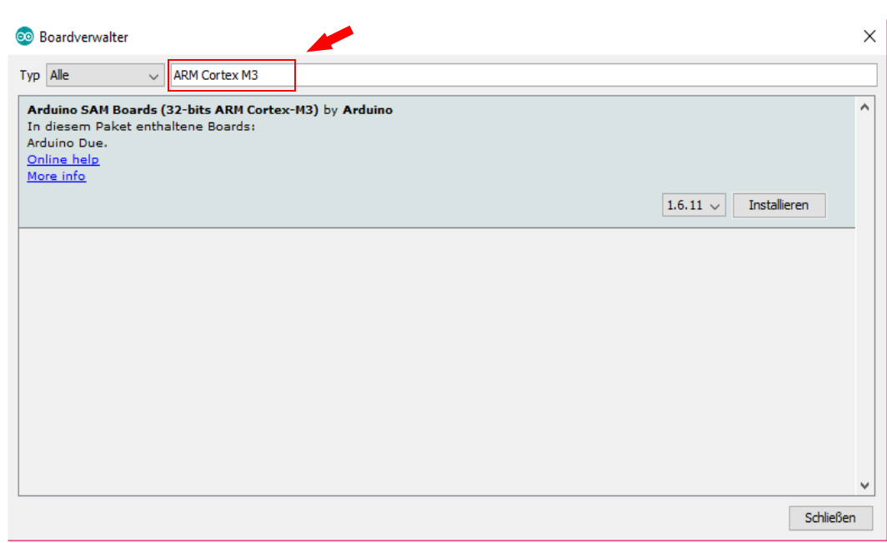
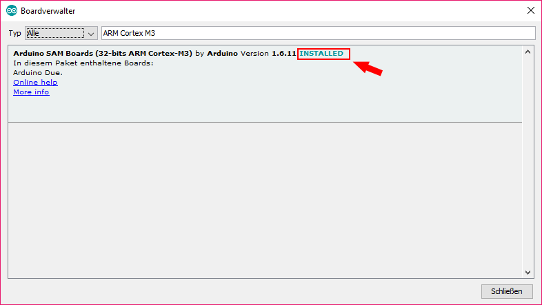
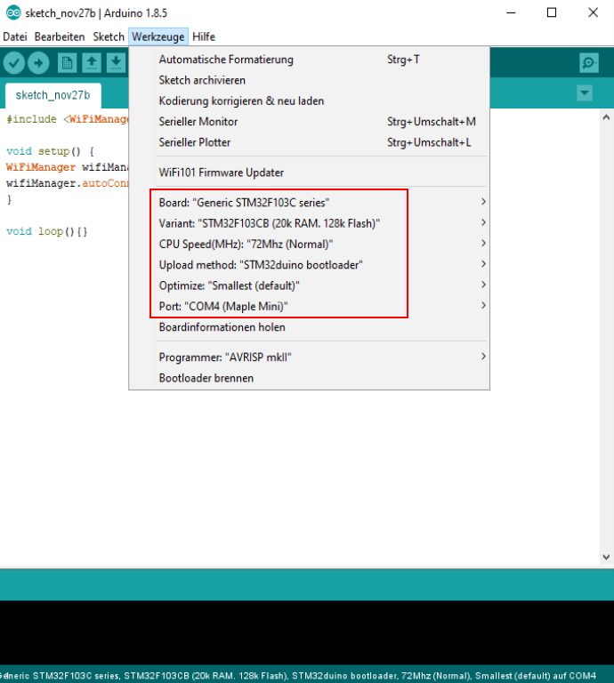

# Installation STM-Board

For the installation of Arduino please look at _Installing Arduino_.

First of all the hardware-files for the STM32-board have to downloaded at <https://github.com/rogerclarkmelbourne/Arduino_STM32> 

The following window is shown:

With the button _"Clone or download"_ (marked red) the file Arduino\_STM32-master.zip can be downloaded. 

After the folder _„Arduino\_STM32-master“_ is unpacked, it has to be copied to _C:\\Program Files (x86)\\Arduino\\hardware_.

If the folder "hardware" does not exist yet, it has to be created.

After that you have to run _„install\_drivers.bat“_. You can find it at C:\\Users\\Username\\Documents\\Arduino\\hardware\\Arduino\_STM32-master\\drivers\\win

After this was installed, Arduino has to be startet and the boardmanager has to be opened, which can be found under Tools --> Boards --> Board Manager... (check picture below).

Search for „ARM Cortex M3“ in the search field in the Board Manager (marked red).

ARM can be installed by clicking the button "Install". After the installation was successful, you will get to see "INSTALLED" next to it.

Now the board can be configured:

The settings can be found in Arduino under "Tools".

For the STM32 board the following settings (marked red in the picture below) are required:

***Board*** Generic STM32F103C series;
***Variant*** 128k Flash
***Speed*** 72Mhz
***Upload*** ***Method*** STM32duino Bootloader
***Optimize*** Smallest
***Port*** COMx (x systemabhängig)

